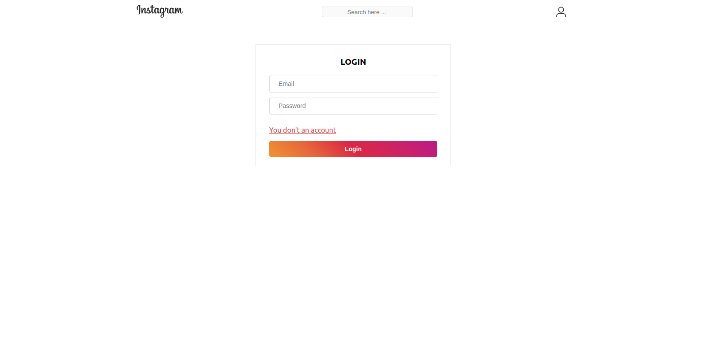
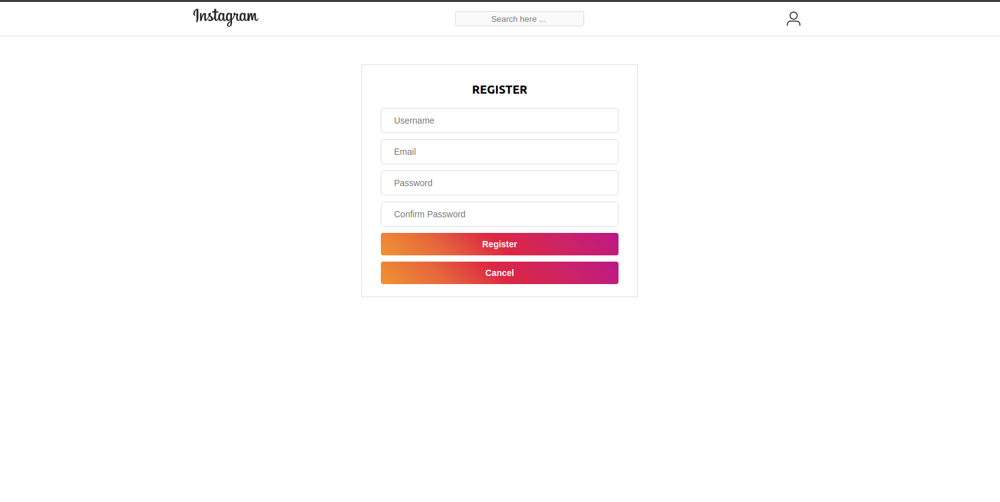
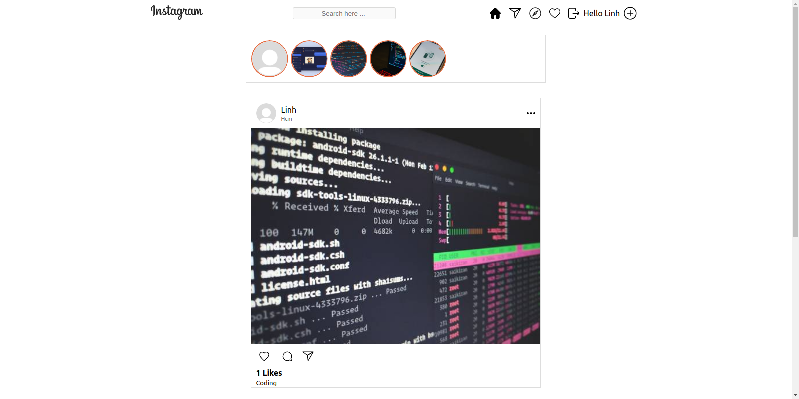
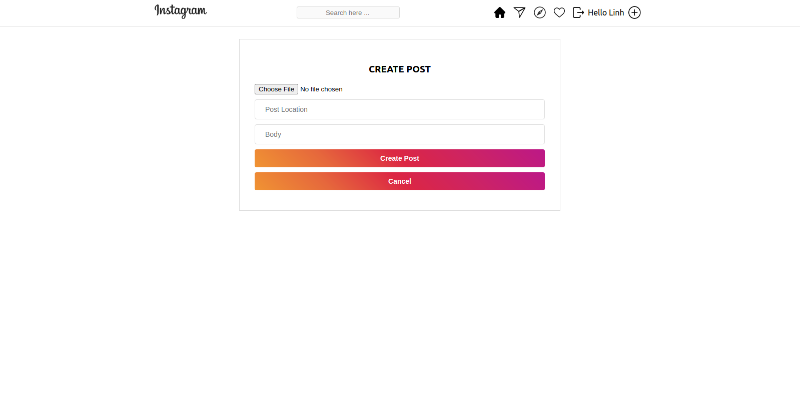

# Social_instagram

JavaScript is the world's most popular programming language. [Javascript](https://www.javascript.com/)

React - A JavaScript library for building user interfaces [ReactJS](https://reactjs.org/)

NodeJS - As an asynchronous event-driven JavaScript runtime, Node.js is designed to build scalable network applications. [NodeJS](https://nodejs.org/en/)

## Installation

Use the package manager [npm](https://www.npmjs.com/) to install app.

```bash
cd /server - npm install
```

```bash
cd /client - npm install
```

## Usage

```
cd /server - npm run serve
```

```
cd /client - npm start
```

## Contributing

Pull requests are welcome. For major changes, please open an issue first to discuss what you would like to change.

Please make sure to update tests as appropriate.

## Image






## License

[MIT](https://choosealicense.com/licenses/mit/)
